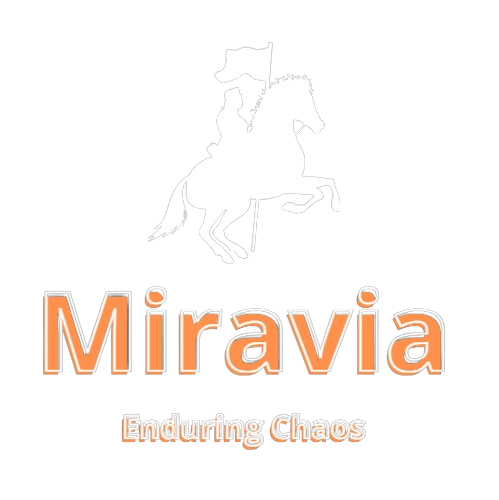
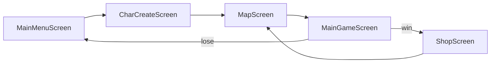

# Miravia

A 2D turn-based, deck-building battle game built with **Java** and **libGDX**, created as a team project for a Software Engineering (*Rekayasa Perangkat Lunak*) course. The project doubles as an applied OOP exercise: abstraction, inheritance, encapsulation, and polymorphism all show up directly in the game's character and combat model.



## Gameplay

1. **Main Menu** → start a new run
2. **Character Creation** → pick a class (archer, warrior, or swordsman), each with its own starting stats and a 5-card starter deck
3. **Map** → head into the next encounter
4. **Battle** → draw a 3-card hand each turn, spend action points (mana) to select cards, and hit End Turn to resolve damage against a randomly leveled enemy with a simple telegraphed AI (it can charge up a double-damage attack over two turns)
5. **Shop** → win gold and score, then spend it on new cards or a full heal before heading back to the map for the next fight

## Tech stack

| | |
|---|---|
| Language | Java |
| Framework | [libGDX](https://libgdx.com/) 1.12.1 |
| Build | Gradle 7.5.1 (multi-module, wrapper included) |
| Desktop backend | LWJGL3 |
| Web backend | GWT 2.10.0 (browser build via Gretty/Jetty dev server) |
| IDE | Eclipse (Buildship) |

## Architecture

The game is a straightforward `Screen`-based state machine on top of libGDX's `Game` class:



Rendering is immediate-mode (no Scene2D/Stage) — each screen owns its own `OrthographicCamera` and draws textures directly in `render()`, checking `Gdx.input` coordinates against hand-rolled hitboxes for "buttons."

The domain/battle model lives in `core`, independent of any rendering backend:

- **`Character`** *(abstract)* — shared stats (`health`, `attack`, `defense`) and behavior for anything that can fight
- **`Player extends Character`** — level, score, money, mana, and an owned `Deck`
- **`Enemy extends Character`** — level-scaled stats and a small random-choice AI
- **`Card`** — name, mana cost, damage, and its own texture/position
- **`Deck`** — a shuffleable, drawable collection of `Card`s
- **`Battle`** — a generic `List<Character>` combat loop that dispatches each participant's turn polymorphically

## Project structure

```
miravia/
├── core/     # game logic, screens, and domain model (platform-agnostic)
├── desktop/  # LWJGL3 launcher (Windows/macOS/Linux)
├── html/     # GWT launcher (browser build)
├── assets/   # sprites, backgrounds, cards, fonts
└── src/      # placeholder module-info (unused by the Gradle build)
```

## Running it

Requires a JDK (8+) on your `PATH`.

**Desktop:**
```
./gradlew desktop:run
```

**Browser (GWT dev mode):**
```
./gradlew html:superDev
```

## Known issues / limitations

This is a course prototype, kept here as an honest snapshot rather than cleaned up for show:

- `desktop/src/.../GameTest.java` is out of sync with the current `Player`/`Enemy`/`Battle` API (different constructors, a missing `isBattling()` method) and JUnit isn't declared as a dependency, so the `desktop` module will not currently compile while this file is present.
- `Player.turn()` contains an unused busy-wait loop (`while(!endTurn){}`) — dead code, since nothing currently calls this method.
- A few name comparisons (e.g. in `Card`/`Player`/`Enemy` constructors) use `==` instead of `.equals()` on strings.
- UI hitboxes/layout are hard-coded per screen rather than using libGDX's `Scene2D`/`Stage` UI toolkit.
- No Android target, no save/persistence, no audio.

## Team

Built as a group project for an RPL (Software Engineering) course. Character/card art is a mix of original team artwork, AI-generated art, and downloaded assets used for coursework purposes.
